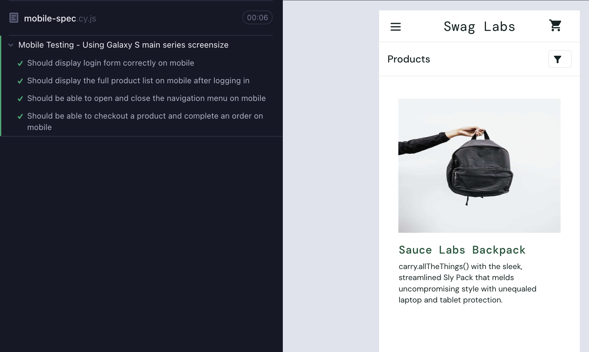
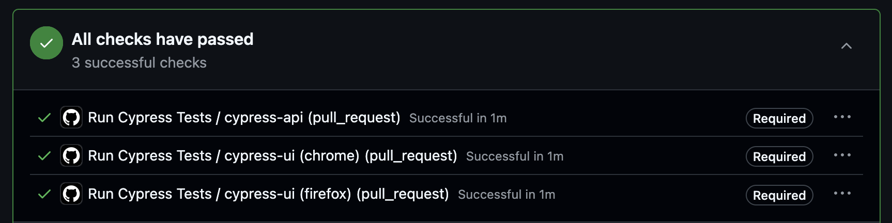
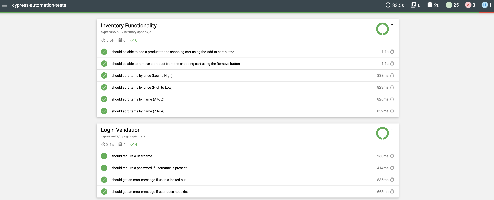

# Cypress QA Automation Portfolio

This project showcases my end-to-end UI and API automation skills using Cypress, with CI/CD integration, cross-browser testing, and bug tracking in Jira.

---

## Project Overview  

| Area | Description |
|------|-------------|
| **UI Testing** | Automated end-to-end tests of the [SauceDemo](https://www.saucedemo.com/) ecommerce test site using Cypress. |
| **Mobile Testing** | Mobile viewport spec to validate SauceDemo’s UI responsiveness. |
| **API Testing** | CRUD API tests for the [Restful Booker](https://restful-booker.herokuapp.com/apidoc) API test site using Cypress. |
| **Bug Tracking** | Known issues documented in Jira, linked to related test coverage. |
| **CI/CD** | GitHub Actions pipeline runs Cypress tests in Chrome and Firefox on each branch merge, blocking merges if tests fail. |
| **Reporting** | Local Mochawesome reports and Cypress Cloud integration for visual pass/fail summaries and replayable test runs. |

---

## Folder Structure

```bash
project-root/
├── cypress/
│   ├── e2e/
│   │   ├── api/         # API tests (Restful Booker)
│   │   ├── ui/          # UI tests (SauceDemo)
│   ├── support/         # Reusable UI commands (login, navigation)
│   ├── reports/         # Mochawesome test reports (local only)
│   ├── data/            # Static records for API test inputs
│   ├── selectors/       # Page object Model selectors for UI tests
├── bug-reports          # Screenshots of Jira bug tickets
```
## Running Tests Locally
1. Make sure you have Git installed: [Download Git](https://git-scm.com/downloads)
2. Clone this repo to your machine: `git clone https://github.com/AlexMolCode/cypress-automation-tests.git`
3. Navigate to the downloaded project directory (cypress-automation-tests) and install dependencies (includes Cypress): `npm install`
4. To successfully run API tests that require an authentication token, create a `cypress.env.json` file in the root directory with the JSON record below.
   Retrieve the credentials from the Restful Booker [API docs](https://restful-booker.herokuapp.com/apidoc/index.html#api-Auth-CreateToken).
```json
{
  "BOOKING_USERNAME": "api-username",
  "BOOKING_PASSWORD": "api-password"
}
```
5. To run all tests on the command line: `npx cypress run`
6. To run tests by each type on the command line:
- API tests: `npx cypress run --spec "cypress/e2e/api/*.cy.js"`
- UI tests: `npx cypress run --spec "cypress/e2e/ui/*.cy.js"`
7. To use the Cypress test runner UI to run tests: `npx cypress open`

## Mobile Testing
This project includes a Cypress spec that validates SauceDemo’s UI responsiveness in a mobile viewport (Samsung Galaxy S22, 360×780). This ensures the application layout and functionality remain consistent on smaller screens. The test file is at `cypress/e2e/mobile-spec.cy.js`.



## Bug Tracking
Automated tests for known bugs are located in:
- `ui-error-spec.cy.js`
- `api-error-spec.cy.js`
- `auth.cy.js` (for authentication-related errors)<br>

Since the JIRA board isn’t publicly accessible, I’ve included screenshots of the bug tickets I created. Each file is named with its Jira ticket number and a short description, and those ticket IDs match the ones referenced in the test cases above. View the folder [here](https://github.com/AlexMolCode/cypress-automation-tests/tree/main/bug-reports).

## CI/CD via GitHub Actions
This project uses GitHub Actions to automatically run Cypress tests on every pull request. The pipeline includes:
- All UI tests using both Chrome and Firefox
- All API tests

These checks ensures all test cases before code is merged, simulating a real-world CI/CD workflow. Below is an example of a successful test run for this branch.




## Local Test Reports with Mochawesome
When Cypress tests are run locally in headless mode (`npx cypress run`), Mochawesome generates an easy-to-read HTML report in the `cypress/reports/` folder. The report lists each scenario as an individual test case with a clear pass/fail status, and attaches screenshots automatically for any failed tests.




## Cypress Cloud Report Integration
On every pull request, the full test suite runs and the results are uploaded to Cypress Cloud.

Cypress Cloud includes:
- Screenshots, videos, and command logs for each test
- A **Test Replay** feature for step-by-step debugging

Previous Cypress Cloud runs for this portfolio can be accessed on the [latest runs page](https://cloud.cypress.io/projects/in78pu/runs).  
Note: API tests using cy.request() are executed in Node (outside the browser). As a result, console logs and network activity will not appear in Test Replay the way they do for UI tests.

For more details on stepping through previous runs, see the [Test Replay Documentation](https://docs.cypress.io/cloud/features/test-replay).
